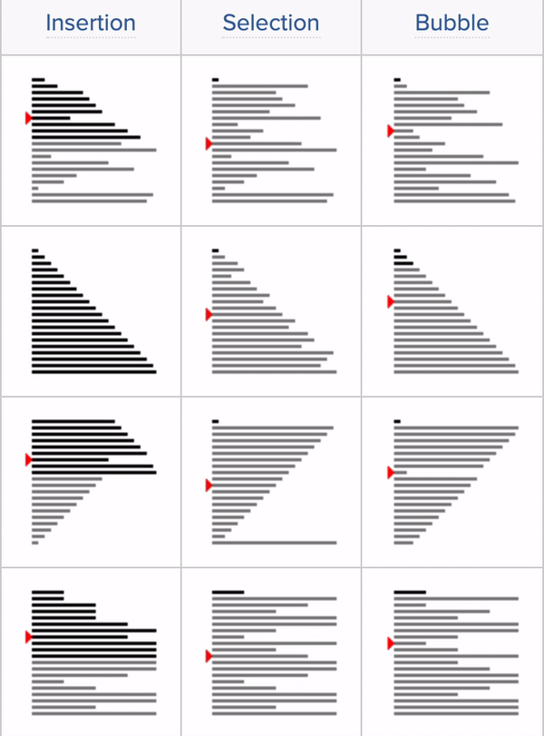

# Basic_Sorting_Argorithm




> ## UNOPTIMIZED VERSION OF BUBBLE SORT: :wink:


``` js
function bubbleSort(arr){
  for(var i = arr.length; i > 0; i--){
    for(var j = 0; j < i - 1; j++){
      console.log(arr, arr[j], arr[j+1]);
      if(arr[j] > arr[j+1]){
        var temp = arr[j];
        arr[j] = arr[j+1];
        arr[j+1] = temp;         
      }
    }
  }
  return arr;
}

console.log(bubbleSort([8,1,2,3,4,5,6,7]))
// [
//   1, 2, 3, 4,
//   5, 6, 7, 8
// ]
```

> ## BUBBLE SORT, ES2015 Version: :wink:
``` js
function bubbleSort(arr) {
  const swap = (arr, idx1, idx2) => {
    [arr[idx1], arr[idx2]] = [arr[idx2], arr[idx1]];
  };

  for (let i = arr.length; i > 0; i--) {
    for (let j = 0; j < i - 1; j++) {
      if (arr[j] > arr[j + 1]) {
        swap(arr, j, j + 1);
      }
    }
  }
  return arr;
}

console.log(bubbleSort([8,1,2,3,4,5,6,7]))
// [
//   1, 2, 3, 4,
//   5, 6, 7, 8
// ]
```


> ## Optimized BubbleSort with noSwaps: :wink:

``` js
function bubbleSort(arr){
  var noSwaps;
  for(var i = arr.length; i > 0; i--){
    noSwaps = true;
    for(var j = 0; j < i - 1; j++){
      if(arr[j] > arr[j+1]){
        var temp = arr[j];
        arr[j] = arr[j+1];
        arr[j+1] = temp;
        noSwaps = false;         
      }
    }
    if(noSwaps) break;
  }
  return arr;
}

console.log(bubbleSort([8,1,2,3,4,5,6,7]))
// [
//   1, 2, 3, 4,
//   5, 6, 7, 8
// ]
```


> ## Selection Sort (non ES2015 syntax): :wink:


``` js
function sselectionSort(arr){
    for(var i = 0; i < arr.length; i++){
        var lowest = i;
        for(var j = i+1; j < arr.length; j++){
            if(arr[j] < arr[lowest]){
                lowest = j;
            }
        }
        if(i !== lowest){
            //SWAP!
            var temp = arr[i];
            arr[i] = arr[lowest];
            arr[lowest] = temp;
        }
    }
    return arr;
}

console.log(selectionSort([0,2,34,22,10,19,17]))
// [
//    0,  2, 10, 17,
//   19, 22, 34
// ]
```


> ## Selection Sort, ES2015 VERSION: :wink:

``` js
function selectionSort(arr) {
  const swap = (arr, idx1, idx2) =>
    ([arr[idx1], arr[idx2]] = [arr[idx2], arr[idx1]]);

  for (let i = 0; i < arr.length; i++) {
    let lowest = i;
    for (let j = i + 1; j < arr.length; j++) {
      if (arr[lowest] > arr[j]) {
        lowest = j;
      }
    }
    if (i !== lowest) swap(arr, i, lowest);
  }

  return arr;
}

console.log(selectionSort([0,2,34,22,10,19,17]))
// [
//    0,  2, 10, 17,
//   19, 22, 34
// ]
```

> ## Insertion Sort: :wink:


``` js
function insertionSort(arr){
  var currentVal;
    for(var i = 1; i < arr.length; i++){
        currentVal = arr[i];
        for(var j = i - 1; j >= 0 && arr[j] > currentVal; j--) {
            console.log(j)
            arr[j+1] = arr[j]
        }
        arr[j+1] = currentVal;
    }
    return arr;
}

console.log(insertionSort([2,1,9,76,4])) //  1, 2, 4, 9, 76 ]

> ## step by step understanding: :wink:

// i=1
// currentval = arr[1] = 1
// j = i -1 = 0
// arr[j] = arr[0] = 2
// arr[j+1] = arr[j]
// arr[1]=arr[0]
// [2,2,9,76,4]

// arr[j+1] = currentVal
// arr[0] = 1
// [1,2,9,76,4]

// i = 2
// currentval = arr[2] = 9
// j = i -1 = 1
// arr[j] = arr[1] = 2
// 2 > 9? False
// arr[j+1] = currentVal
// arr[2] = 9
// [[1,2,9,76,4]]

// i = 3
// currentval = arr[3] = 76
// j = i -1 = 2
// arr[j] = arr[2] = 9
// 9 > 76? 
// arr[j+1] = currentVal
// arr[3] = 76 False
// [[1,2,9,76,4]]

// i = 4
// currentval = arr[4] = 4
// j = i -1 = 3
// arr[j] = arr[3] = 76
// 76 > 4? True
// arr[j+1] = arr[j]
// arr[4] = arr[3]
// [[1,2,9,76,76]]
// j--, j = 2
// arr[j] > currentVal
// arr[2] > currentval = 4?
// 9 > 4? True
// arr[j+1] = arr[j]
// arr[3] = arr[2]
// [[1,2,9,9,76]]
// j--, j = 1
// arr[j] > currentVal
// arr[1] > currentval = 4?
// 1 > 4? False
// arr[j+1] = currentVal
// arr[2] = currentVal = 4
// [[1,2,4,9,76]]
```
